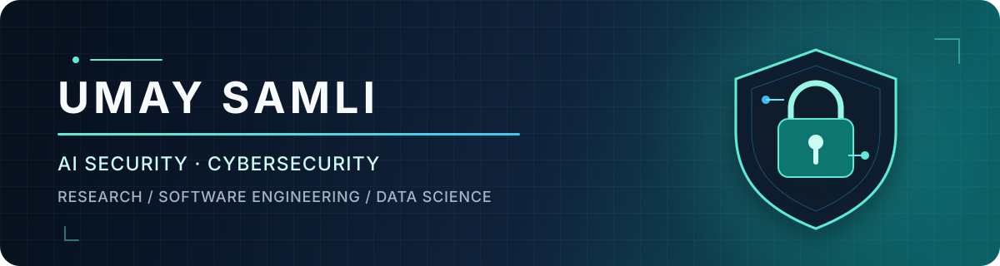

  

   

  
  
  
  

 

<table>
  <tr>
    <td width="175" align="center">
      
    </td>
    <td>
      <h2>About me</h2>
      

        I am a <strong>computer scientist and AI security researcher</strong> with experience spanning
        cybersecurity, software engineering, and applied data science. My background includes research
        at TED University and engineering roles at NATO, Infinitum IT, Histocan, Turkish Aerospace,
        ASELSAN, and Savronik.
      

      
<strong>Currently:</strong> Researcher at TED University · MSc in Computer Science

    </td>
  </tr>
</table>

## Areas of focus

| | Area | Perspective |
| :---: | :--- | :--- |
| 🛡️ | **AI Security** | Researching security at the intersection of AI and computing |
| 🔐 | **Cybersecurity** | Experience across operational and engineering environments |
| ⚙️ | **Software Engineering** | Building on roles across research, aerospace, health, and IT |
| 📊 | **Applied Data Science** | Academic foundation alongside computer engineering |

## Experience

| Period | Role | Organization |
| :--- | :--- | :--- |
| **Jun 2026 — Present** | Researcher | **TED University** |
| Nov 2025 — Jun 2026 | Software Engineer | **Infinitum IT** |
| May 2025 — Nov 2025 | Cyber Security Engineer | **NATO** |
| Jan 2025 — Apr 2025 | Lead Software Engineer | **Histocan** |
| Sep 2023 — Oct 2024 | Cyber Security Engineer Intern | **NATO** |
| Nov 2022 — May 2023 | Candidate Software Engineer | **TAI · Turkish Aerospace** |
| Jul 2022 — Aug 2022 | Software Engineer Intern | **ASELSAN** |
| Jun 2021 — Sep 2021 | Software Engineer Intern | **Savronik** |

## Education

| Period | Degree | Institution | GPA |
| :--- | :--- | :--- | :---: |
| **Jan 2026 — Present** | Master's · Computer Science | **TED University** | **4.0 / 4.0** |
| Sep 2019 — Jun 2023 | BSc · Computer Engineering | **TED University** | **3.8 / 4.0** |
| Feb 2021 — Jun 2023 | Secondary Degree · Applied Data Science | **TED University** | **4.0 / 4.0** |

  
<strong>Professional references and letters</strong>

   

  | Name | Title | Letter |
  | :--- | :--- | :---: |
  | **Dr. Burak Ekici** | Senior Researcher · **University of Oxford** | [View PDF](./CVs_and_Letters/Recommendation%20and%20Reference%20Letters/Reference%20Letter%20-%20Burak%20Ekici%20-%20University%20of%20Oxford.pdf) |
  | **Holger Spohn** | CISO, Head of Operational IT · **Candriam** (formerly NATO) | [View PDF](./CVs_and_Letters/Recommendation%20and%20Reference%20Letters/Reference%20Letter%20-%20Holger%20Spohn-%20NATO.pdf) |
  | **Dr. Ulas Gulec** | CEO · **Simovate** / Assistant Professor · **TED University** | [View PDF](./CVs_and_Letters/Recommendation%20and%20Reference%20Letters/Reference%20Letter%20-%20Ulas%20Gulec%20-%20TED%20University.pdf) |
  | **Dr. Emin Kugu** | Assistant Professor · **TED University** | [View PDF](./CVs_and_Letters/Recommendation%20and%20Reference%20Letters/Reference%20Letter%20-%20Emin%20KUGU%20-%20TED%20University.pdf) |
  | **Andrea Accetta** | Head of Cyber Operations · **SHAPE / NATO** | — |
  | **Kadri Yetis** | CTO, VP Software Engineering · **MS** | — |
  | **Leo Fehmi Aslan** | Senior Cyber Security Analyst · **NATO / NCIA** | — |
  | **Luke O'Brien** | Senior Cyber Security Engineer · **NATO / CDT** | — |

 

  <strong>Research · Engineer · Secure</strong>
    
  <a href="https://umaysamli.com">Explore my work at umaysamli.com →</a>

