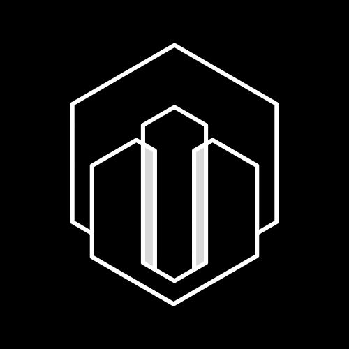

<table>
  <tr>
    <td width="175" align="center">
      
    </td>
    <td>
      <h2>About me</h2>
      

        I am a <strong>computer scientist focused on two areas: AI security, both offensive and defensive,
        and low-level development</strong>. I engineered the backbone across backend, frontend, and complex
        system design, so the research ships.
      

      
<strong>Currently:</strong> Researcher at TED University · MSc in Computer Engineering · founder of <a href="https://hanamiproducts.com">Hanami Products</a>

      
<strong>Other account:</strong> <a href="https://github.com/kuzeytheconqueror">@kuzeytheconqueror</a> — used for starting and checking out other projects

    </td>
  </tr>
</table>

## Areas of focus

| | Area | Background |
| :---: | :--- | :--- |
|  | **AI Security** | Offensive and defensive security of AI and ML systems: red teaming, LLM and agent security, guardrails, alignment |
|  | **Low-Level Development** | Operating systems, systems internals, and close-to-the-metal engineering |

## Selected projects

| Project | What | Status |
| :--- | :--- | :---: |
| [**Insider-Behavior Detection Through LLM Self-Logging**](https://github.com/samliumay/INSIDER_LLM_DETECTION_CODE) | Tests whether discrepancies between an authoritative tool-action trace and an LLM's own `log_action` reports can flag policy-relevant behavior · [dataset](https://huggingface.co/datasets/logicBombExe/INSIDER_LLM_DETECTION_BENCHMARK) | Ongoing research |
| [**Hanami Products**](https://hanamiproducts.com) | My one-person software studio: [Hanami Planner](https://hanamiplan.com) (live) and Hanami DNA (beta) | Live |
| [**Local LLM Pentesting Lab**](https://github.com/samliumay/local_llm_pentesting_lab) | A deliberately imperfect, fully local banking assistant for practicing LLM application security testing | Lab |
| [**LLM Firewalls: An Introduction**](https://github.com/samliumay/llm_firewalls_an_introduction) | A proof-of-concept application boundary that inspects model-generated SQL before it reaches PostgreSQL | Educational PoC |
| [**Kuzey Agent**](https://github.com/samliumay/kuzey_agent) | My personal terminal AI agent, written from scratch in Rust | In progress |
| [**FHR: Fog and Haze Remover**](https://github.com/samliumay/FHR) | Brings well-known dehazing algorithms together so researchers can compare them side by side | Research |

More on [umaysamli.com/projects](https://umaysamli.com/projects).

## Experience

| Period | Role | Organization |
| :--- | :--- | :--- |
| **Jun 2026 — Present** | Researcher (part-time) | **TED University** |
| Nov 2025 — Jun 2026 | Software Engineer | **InfinitumIT** |
| May 2025 — Nov 2025 | Cyber Security Engineer | **NATO** |
| Jan 2025 — May 2025 | Lead Software Engineer | **HistoCan** |
| Sep 2023 — Oct 2024 | Cyber Security Engineer (internship) | **NATO** |
| Nov 2022 — May 2023 | Software Engineer (part-time) | **TAI · Turkish Aerospace** |
| Jul 2022 — Aug 2022 | Software Engineer (internship) | **Aselsan** |
| Jun 2021 — Sep 2021 | Software Engineer (internship) | **Savronik** |

## Education

| Period | Degree | Institution | GPA |
| :--- | :--- | :--- | :---: |
| **Feb 2026 — Present** | Master's · Computer Engineering | **TED University** | **4.0 / 4.0** |
| Sep 2019 — Jun 2023 | BSc · Computer Engineering | **TED University** | **3.8 / 4.0** |
| Feb 2021 — Jun 2023 | Secondary Degree · Applied Data Science | **TED University** | **4.0 / 4.0** |

## Certifications

**CLLMSE** and **CLLMSP** (Red Team Leaders) · **eJPT** and **ICCA** (INE Security) · **Certified AI Agent Security Specialist** (Proofpoint) · **CCNA** and **CyberOps Associate** (Cisco) · full list on [umaysamli.com/certifications](https://umaysamli.com/certifications).

 

  
<strong>References and letters</strong>

   

  | Name | Title | Letter |
  | :--- | :--- | :---: |
  | **Dr. Burak Ekici** | Senior Researcher · **University of Oxford** | [View PDF](./Letters/Reference%20Letter%20-%20Burak%20Ekici%20-%20University%20of%20Oxford.pdf) |
  | **Holger Spohn** | CISO, Head of Operational IT · **Candriam** (formerly Principal Engineer, Cyber Defence, NATO HQ) | [View PDF](./Letters/Reference%20Letter%20-%20Holger%20Spohn-%20NATO.pdf) |
  | **Dr. Ulas Gulec** | CEO · **Simovate** / Assistant Professor · **TED University** | [View PDF](./Letters/Reference%20Letter%20-%20Ulas%20Gulec%20-%20TED%20University.pdf) |
  | **Dr. Emin Kugu** | Assistant Professor · **TED University** | [View PDF](./Letters/Reference%20Letter%20-%20Emin%20KUGU%20-%20TED%20University.pdf) |

 

   
  Current language favorites
    
   <code>Rust</code> &nbsp;·&nbsp;  <code>C++</code>
    
  
  
  
  
  
  

